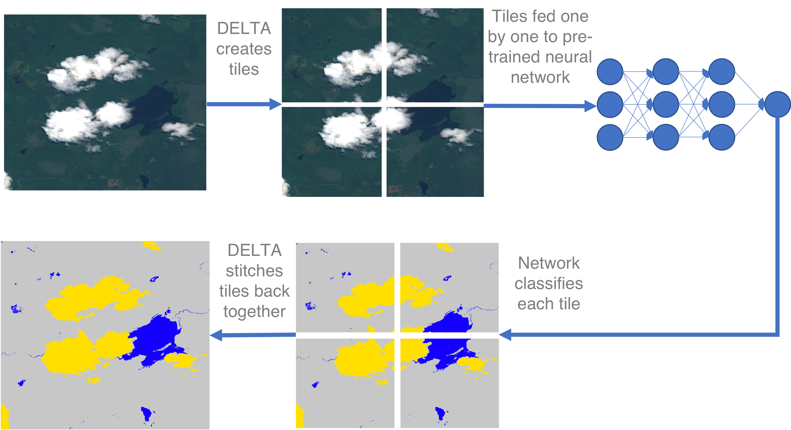
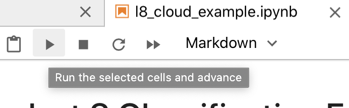
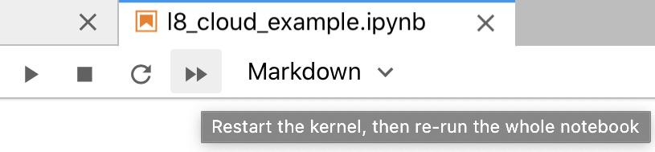

**DELTA** (Deep Earth Learning, Tools, and Analysis) is a framework for deep learning on satellite imagery,
based on Tensorflow. DELTA classifies large satellite images with neural networks, automatically handling
tiling large imagery.



DELTA is under active development by the
[NASA Ames Intelligent Robotics Group](https://ti.arc.nasa.gov/tech/asr/groups/intelligent-robotics/) through the end of 2021.
Initially, it is mapping floods for disaster response, in collaboration with the
[U.S. Geological Survey](http://www.usgs.gov), [National Geospatial Intelligence Agency](https://www.nga.mil/),
[National Center for Supercomputing Applications](http://www.ncsa.illinois.edu/), and
[University of Alabama](https://www.ua.edu/).

Installation
============

1. Install [python3](https://www.python.org/downloads/), [GDAL](https://gdal.org/download.html),
   and the [GDAL python bindings](https://pypi.org/project/GDAL/). For Ubuntu Linux, you can run
   `scripts/setup.sh` from the DELTA repository to install these dependencies.

2. Install Tensorflow following the [instructions](https://www.tensorflow.org/install). For
   GPU support in DELTA (highly recommended) follow the directions in the
   [GPU guide](https://www.tensorflow.org/install/gpu).

3. Checkout the delta repository and install with pip:

    ```bash
    git clone http://github.com/nasa/delta
    python3 -m pip install delta
    ```

DELTA is now installed and ready to use!

### Alternate install using a Conda environment
1. Install [Miniconda](https://docs.conda.io/en/latest/miniconda.html).

2. Checkout the delta repository and cd into the directory:
    ```
    git clone http://github.com/nasa/delta
    cd ./delta
    ```
   
3. Run the following commands to create a conda environment, install dependences, and install delta:
    ```bash
   conda create --name delta --yes python gdal
    conda activate delta
    pip install . # This command should be run in the ./delta directory we made in step 2
    ```
4. For GPU support in DELTA you'll need to install the [required NVIDIA software](https://www.tensorflow.org/install/gpu#software_requirements) before running the conda commands in step 3.

### Installing ESA SNAP ####

In order to process Sentinel-1 images you will need to instal the ESA SNAP tool.  You can download it here:
```https://step.esa.int/main/download/snap-download/```

Once it is installed, you will need to add SNAP's bin folder to your path like this:
```export PATH=$PATH:/where/you/installed/snap/bin```

Documentation
=============

- README Docs
  - [DELTA Config README](delta/config/README.md) - details on how to configure DELTA from the command line using .yaml files.
  - [DELTA built-in networks README](delta/config/networks/README.md) - details some of the available network architecture .yaml files already included with DELTA. 
- [Python Documentation](https://nasa.github.io/delta/) - DELTA can be used either as a command line tool or as a python library. You can view the documentation at the linked URL or generate the documentation with [`scripts/docs.sh`](scripts/docs.sh).
  - `delta.config.extensions` [documentation](https://nasa.github.io/delta/config/extensions.html) - details on extending DELTA for use with custom layers, image types, preprocessing, etc.
  
Example
=======

### Bash Script Example (Linux Only)

As a simple example, consider training a neural network to map clouds with Landsat-8 images.
The script [`scripts/example/l8_cloud.sh`](scripts/example/l8_cloud.sh) trains such a network using DELTA from the
[USGS SPARCS dataset](https://www.usgs.gov/core-science-systems/nli/landsat/spatial-procedures-automated-removal-cloud-and-shadow-sparcs),
and shows how DELTA can be used. The steps involved in this, and other, classification processes are:

1. **Collect** training data. The SPARCS dataset contains Landsat-8 imagery with and without clouds.

2. **Label** training data. The SPARCS labels classify each pixel according to cloud, land, water and other classes.

3. **Train** the neural network. The script `scripts/example/l8_cloud.sh` invokes the command

    ```
    delta train --config l8_cloud.yaml l8_clouds.h5
    ```

    where `scripts/example/l8_cloud.yaml` is a configuration file specifying the labeled training data and
    training parameters (learn more about configuration files below). A neural network file
    `l8_clouds.h5` is output.

4. **Classify** with the trained network. The script runs

    ```
    delta classify --config l8_cloud.yaml --image-dir ./validate --overlap 32 l8_clouds.h5
    ```

    to classify the images in the `validate` folder using the network `l8_clouds.h5` learned previously.
    The overlap tiles to ignore border regions when possible to make a more aesthetically pleasing classified
    image. The command outputs a predicted image and confusion matrix.

The results could be improved--- with more training, more data, an improved network, or more--- but this
example shows the basic usage of DELTA.

### JupyterLab Example (Linux/Mac)

The [jupyter lab example](scripts/example/l8_cloud_example.ipynb) is very similar to the bash script example above but has a more visual demonstration of the steps and imagery used. It is especially helpful if you are less experienced with the command line.

You can view a read-only version at the above link. Or if you'd like to run the example yourself you'll need to install JupyterLab. To do that you can simply run 

```pip install jupyterlab``` 

after [installing DELTA using the above instructions.](#Installation) Then run 

```jupyter-lab path_to_delta_install/scripts/example/l8_cloud_example.ipynb``` 

Once jupyter loads, you can advance through the cells one by one using the "play" button 



or run all the cells at once using the "fast-foward" button.



Configuration and Extensions
============================

DELTA provides many options for customizing data inputs and training. All options are configured via
YAML files. Some options can be overwritten with command line options (use
`delta --help` to see which). See the [`delta.config` README](delta/config/README.md) to learn about available configuration
options.

DELTA can be extended to support custom neural network layers, image types, preprocessing operations, metrics, losses,
and training callbacks. Learn about DELTA extensions in the `delta.config.extensions` [documentation](https://nasa.github.io/delta/config/extensions.html).

Data Management
=============

DELTA integrates with [MLFlow](http://mlflow.org) to track training. MLFlow options can
be specified in the corresponding area of the configuration file. By default, training and
validation metrics are logged, along with all configuration parameters. The most recent neural
network is saved to a file when the training program is interrupted or completes.

View all the logged training information through mlflow by running::

```
  delta mlflow_ui
```

and navigating to the printed URL in a browser. This makes it easier to keep track when running
experiments and adjusting parameters.

Data Preparation
=============

By default DELTA operates on compressed input images which are unpacked to a temporary cache before
they are processed.  You can speed up processing by pre-unpacking your input data to a new folder
using the tool [scripts/fetch/unpack_inputs.py](scripts/fetch/unpack_inputs.py) as in this example:

```
  python3 scripts/fetch/unpack_inputs.py --input-folder raw_images --output-folder unpacked_images \
  --image-type worldview --image-ext .zip
```

The images will be unpacked in the output folder, ready for training or classification. To train or
classify with unpacked data, the image type specified in the configuration file remains the same but
the extension should match the new extension in the unpacked folders (.tif for worldview, .vrt for Sentinel1).

Contributors
============
We welcome pull requests to contribute to DELTA. However, due to NASA legal restrictions, we must require
that all contributors sign and submit a
[NASA Individual Contributor License Agreement](https://www.nasa.gov/sites/default/files/atoms/files/astrobee_individual_contributor_license_agreement.pdf).
You can scan the document and submit via email. Thank you for your understanding.

Important notes for developers:

 * **Branching**: Active development occurs on `develop`. Releases are pushed to `master`.

 * **Code Style**: Code must pass our linter before merging. Run [`scripts/linter/install_linter.sh`](scripts/linter/install_linter.sh) to install
   the linter as a git pre-commit hook.

 * **Unit Tests**: Code must pass unit tests before merging. Run `pytest` in the `tests` directory to run the tests.
   Please add new unit tests as appropriate.

 * **Development Setup**: You can install delta using pip's `-e` flag which installs in editable mode. Then you can
   run `delta` and it will use your latest changes made to the repo without reinstalling.

Licensing
=========
DELTA is released under the Apache 2 license.

Copyright (c) 2020, United States Government, as represented by the Administrator of the National Aeronautics and Space Administration. All rights reserved.
